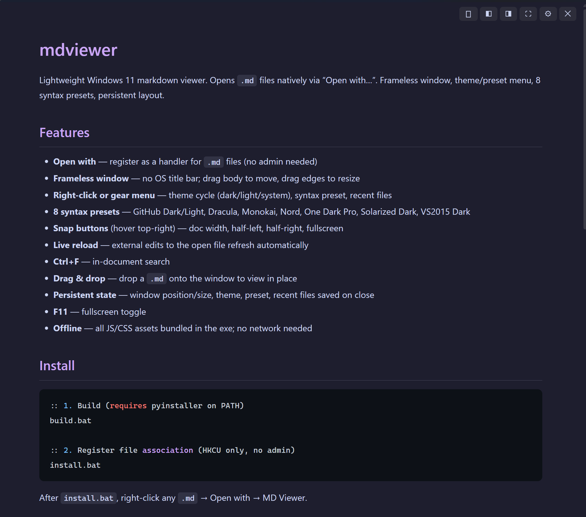

# mdviewer

Lightweight Windows 11 markdown viewer. Opens `.md` files natively via "Open with…". Frameless window, theme/preset menu, 8 syntax presets, persistent layout.



## Features

- **Open with** — register as a handler for `.md` files (no admin needed)
- **Frameless window** — no OS title bar; drag body to move, drag edges to resize
- **Right-click or gear menu** — theme cycle (dark/light/system), syntax preset, recent files
- **8 syntax presets** — GitHub Dark/Light, Dracula, Monokai, Nord, One Dark Pro, Solarized Dark, VS2015 Dark
- **Snap buttons** (hover top-right) — doc width, half-left, half-right, fullscreen
- **Live reload** — external edits to the open file refresh automatically
- **Ctrl+F** — in-document search
- **Drag & drop** — drop a `.md` onto the window to view in place
- **Persistent state** — window position/size, theme, preset, recent files saved on close
- **F11** — fullscreen toggle
- **Offline** — all JS/CSS assets bundled in the exe; no network needed

## Install

```bat
:: 1. Build (requires pyinstaller on PATH)
build.bat

:: 2. Register file association (HKCU only, no admin)
install.bat
```

After `install.bat`, right-click any `.md` → Open with → MD Viewer.

## Dev setup

```bash
pip install -r requirements.txt
# Python 3.14+: if pywebview fails, run: pip install pythonnet --pre
python fetch_assets.py        # download + embed JS/CSS into assets.py (once)
python mdviewer.py test.md    # run without building exe
pytest tests/                 # unit tests
node tests/test_theme_cycle.mjs
```

Debug log: `set MDVIEWER_DEBUG=1` before launching — writes to `%APPDATA%\mdviewer\debug.log`.

## File structure

```
mdviewer.py        # entry: window wiring, file watcher
debug.py           # _DEBUG / _dlog (leaf)
assets.py          # base64 JS/CSS bundle (patched by fetch_assets.py)
config.py          # load/save, portable path, recent, version
geometry.py        # Win32 geometry, clamp, reading width
api.py             # pywebview Api bridge
template.py        # build_html() HTML/CSS/JS page
fetch_assets.py    # dev tool: downloads markdown-it + highlight.js, patches assets.py
install.bat        # registers Windows file association
build.bat          # PyInstaller one-liner → dist/mdviewer.exe (+ version.txt bundle)
tests/
  test_config.py   # unit tests (config, clamp, snap math, encoding)
  test_theme_cycle.mjs  # theme-cycle JS logic test (from template.py)
test.md            # sample file with code blocks
```

## Config

Default: `%APPDATA%\mdviewer\config.json`

Portable: place `config.json` next to `mdviewer.exe` (or `mdviewer.py` in dev) to override.

```json
{
  "theme": "dark",
  "preset": "github-dark",
  "window": { "width": 900, "height": 700, "x": 200, "y": 150 },
  "recent": ["C:\\path\\to\\file.md"]
}
```

`theme` may be `system` (follows OS light/dark while running). Delete config to reset.

## Architecture notes

- **pywebview 6.x + WinForms** — frameless window via `FormBorderStyle.None`. Native resize re-enabled post-creation by adding `WS_THICKFRAME` via `SetWindowLongW`.
- **API introspection trap** — pywebview's `get_functions()` recursively walks public attributes on the `js_api` object. All non-callable state must be underscore-prefixed (`self._window`, `self._hwnd`) or pywebview recurses into .NET objects and dumps ~2.6 MB of COM exceptions per launch.
- **Window geometry** — never trust `window.screenX/Y` in WebView2 frameless mode (returns 0). Use Win32 `GetWindowRect` + `MonitorFromWindow` for all position/snap logic.
- **Doc width snap** — `snap('reading')` uses `AdjustWindowRectEx` so thickframe borders don't shrink the prose column.
- **Encoding** — UTF-8 (with BOM) preferred; Windows-1252 fallback for legacy files.
- **Assets** — `fetch_assets.py` downloads markdown-it.js + highlight.js + 8 CSS themes from cdnjs and base64-encodes them into `assets.py`. Fully offline after that.

## Stack

| Layer | Choice |
|-------|--------|
| Runtime | Python 3.12+, pywebview 6.x |
| Renderer | Edge WebView2 (built into Windows 11) |
| Markdown | markdown-it.js 13.x (bundled) |
| Syntax | highlight.js 11.x (bundled) |
| Packaging | PyInstaller `--onefile --noconsole` → ~21 MB |
| File assoc | HKCU registry, no admin |